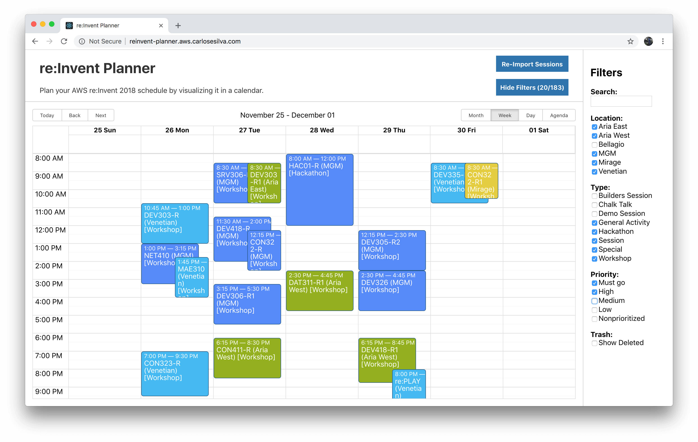

# re:Invent Planner

Plan your AWS re:Invent 2018 sessions by visualizing it in a calendar.

Hosted app: http://reinvent-planner.aws.carlosesilva.com

How-to video: https://www.dropbox.com/s/ox4vf6ahidd3z3y/reinvent-planner.mov?dl=0



## Run it locally

### Requirements

- Node v8.11 or higher

### Steps

- Clone this repository
- Install node dependencies

  ```
  $ npm install
  ```

- Start development server

  ```
  $ npm start
  ```

The app should now be accessible at http://localhost:3000
